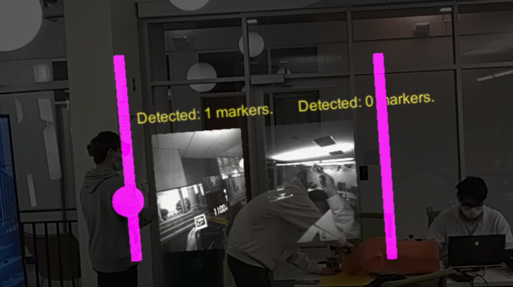

# Use of Hololens 2 Built-in Environmental Cameras for Out-of-sight Object Awarenes
This is the course project for Johns Hopkins University Spring 2022 EN.601.454/654 Augmented Reality. In this project, we utilize the Reaserach Mode of Hololens 2 to access the far left (LEFT_LEFT) and far right (RIGHT_RIGHT) environmental grayscale cameras. THen we detect ArUco tags with these cameras and show their positions through a simple slide bar UI. In that way, we can expand user's horizontal field-of-view (FoV) to nearly 180°.

## Group Members
Kaiwen Wang, Zixuan Wang, Janice Lin

## About
- Tested with Unity 2019.4.28f1, Visual Studio 2019, and the HoloLens 2
- Utilizing the Research Mode Unity library from this [repo](https://github.com/petergu684/HoloLens2-ResearchMode-Unity).
- Utilizing the ArUco dtection Unity library from this [repo](https://github.com/doughtmw/display-calibration-hololens).

## Enable Research Mode
- Before you start, please follow this [tutorial](https://docs.microsoft.com/en-us/windows/mixed-reality/develop/advanced-concepts/research-mode) to enable Research Mode on Hololens 2.

## Run sample
- Open sample in Unity
- Switch build platform to `Universal Windows Platform`, select `HoloLens` for target device, and `ARM64` as the target platform
- Select `FoV_expansion` in `Scenes in Build`.
- Build Visual Studio project.
- To enable Research Mode capability,in yout build directory, open `FoV_expansion/Package.appxmanifest` with a text editor. Add `xmlns:rescap="http://schemas.microsoft.com/appx/manifest/foundation/windows10/restrictedcapabilities"` before the `IgnorableNamespaces` in Package tag (line 2). Add `<rescap:Capability Name="perceptionSensorsExperimental" />` in the Capabilities tag between `<uap2:Capability ... >` and `<DeviceCapability ... >`.
- Open .sln file
- In Visual Studio 2019, change the configuration to `Release` and change the build platform to 'ARM64'. Also select Remote Machine if you want to wirelessly deploy the application.

- Go to `Project > Properties > Configuration Properties > Debugging > Machine Name`. Enter the IP address of your Hololens 2.
- Then go to `Debug > Start Without Debugging` to deploy the application.
- The application will start automatically once successfully deployed. However the enviromental cameras could not be immediately accessed. You need to first fully kill the application (exit the app through start menu for at least two times or kill it from Device Portal). Then relaunch the application. Once you see the streaming of two cameras, that means the launch succeeds.

- If the previous step does not work, please go to `Settings` to make sure the application has access to camera.
